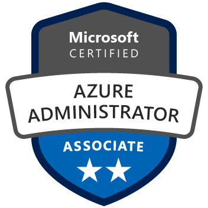
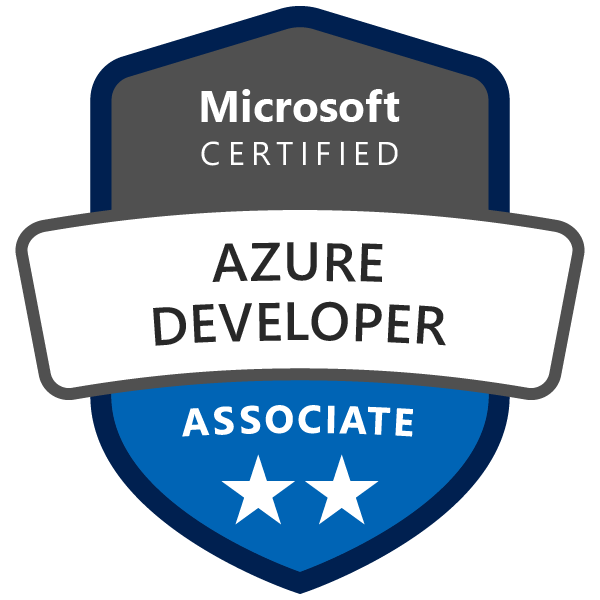
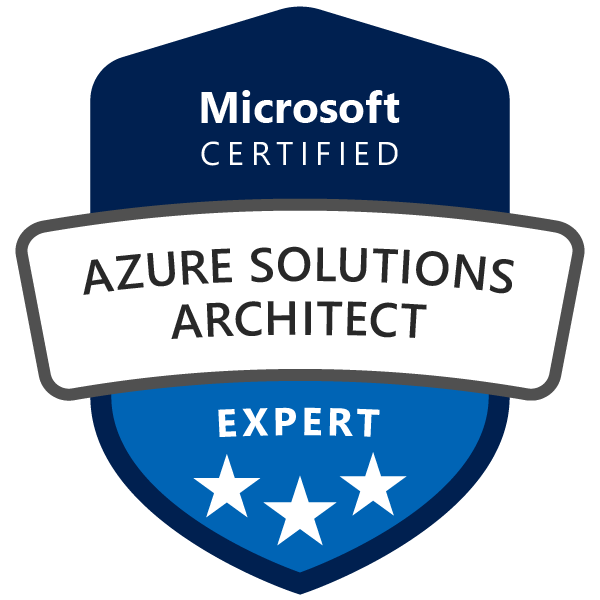

# mattiasholm
Code and cheat sheets to facilitate the daily life of an Azure Solutions Architect!

**Mattias Holm**\
Cloud Architect
>[LinkedIn](https://linkedin.com/in/holmmattias)

 

<a href="https://www.youracclaim.com/badges/4fb718ce-e074-4835-885e-04510f87e6e0/public_url">
<a href="https://www.youracclaim.com/badges/00058815-10e3-4b85-a8c5-bdce28a5a6db/public_url">
<a href="https://www.youracclaim.com/badges/b5798581-7430-472d-a362-5e0049786f23/public_url">