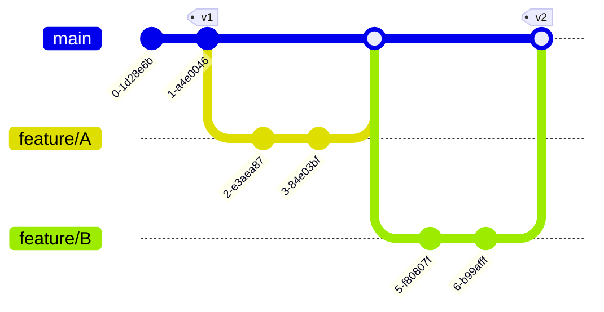

# Cheat Sheet - Markdown

<br>

# Heading 1:

```markdown
# Heading 1

-OR-

Heading 1
=========
```

## Heading 2:

```markdown
## Heading 2

-OR-

Heading 2
---------
```

### Heading 3

```markdown
### Heading 3
```

#### Heading 4

```markdown
#### Heading 4
```

##### Heading 5

```markdown
##### Heading 5
```

###### Heading 6

```markdown
###### Heading 6
```

<br><br>

Regular text

```markdown
Regular text
```

**Bold text**

```markdown
**Bold text**

-OR-

__Bold text__
```

*Italic text*

```markdown
*Italic text*

-OR-

_Italic text_
```

~~Strikethrough text~~

```markdown
~~Strikethrough text~~
```

***Bold and italic text***

```markdown
***Bold and italic text***

-OR-

___Bold and italic text___
```

`Highlighted text`

```markdown
`Highlighted text`
```

\#

\-

\*

\+

\|

```markdown
\#

\-

\*

\+

\|
```

<br><br>

```bash
echo "string"
```

~~~markdown
```bash
echo "string"
```
~~~
-OR-

```markdown
~~~bash
echo "string"
~~~
```

<br><br>

[Google](https://www.google.com)  
https://www.google.com  
<info@example.com>

```markdown
[Google](https://www.google.com)  
https://www.google.com  
<info@example.com>
```

<br><br>

| Header | Left-aligned | Centered | Right-aligned |
| ------ | :----------- | :------: | ------------: |
| A1     | B1           |    C1    |            D1 |
| A2     | B2           |    C2    |            D2 |

```markdown
| Header | Left-aligned | Centered | Right-aligned |
| ------ | :----------- | :------: | ------------: |
| A1     | B1           |    C1    |            D1 |
| A2     | B2           |    C2    |            D2 |
```

<br><br>

- An
  - Unordered
    - Bullet List

```markdown
- An
  - Unordered
    - Bullet List

-OR-

* An
  * Unordered
    * Bullet List

-OR

+ An
  + Unordered
    + Bullet List
```

<br><br>

1. A numbered list
   1. A nested numbered list
   2. Which is numbered
2. Which is numbered

```markdown
1. A numbered list
   1. A nested numbered list
   2. Which is numbered
2. Which is numbered
```

<br><br>

- [ ] An uncompleted task
- [x] A completed task

```markdown
- [ ] An uncompleted task
- [x] A completed task
```

<br><br>

> Blockquote
>> Nested blockquote
>>
>> With multiple lines

```markdown
> Blockquote
>> Nested blockquote
>>
>> With multiple lines
```

<br><br>

---

```markdown
---

-OR-

- - -

-OR-

***

-OR-

* * *

-OR-

___

-OR-

_ _ _
```

<br><br>


```markdown

```

<br><br>


```markdown

```

<br><br>

<details>
  <summary>Foldable text</summary>
  <p>Text only visible when expanded</p>
</details>

```markdown
<details>
  <summary>Foldable text</summary>
  <p>Text only visible when expanded</p>
</details>
```

<br><br>

<kbd>⌘F</kbd>

```markdown
<kbd>⌘F</kbd>
```

| Key       | Symbol |
| --------- | ------ |
| Option    | ⌥      |
| Control   | ⌃      |
| Command   | ⌘      |
| Shift     | ⇧      |
| Caps Lock | ⇪      |
| Tab       | ⇥      |
| Esc       | ⎋      |
| Power     | ⌽      |
| Return    | ↩      |
| Delete    | ⌫      |
| Up        | ↑      |
| Down      | ↓      |
| Left      | ←      |
| Right     | →      |

<br><br>

:white_check_mark:  
:x:

```markdown
:white_check_mark:  
:x:
```

[Emojipedia](https://emojipedia.org/)

<br><br>



~~~markdown

~~~

<br>


~~~markdown

~~~

<br>


~~~markdown

~~~

<br>


~~~markdown

~~~

<br>


~~~markdown

~~~

<br>

```mermaid
gantt
  title Gantt chart

  section Section
  Completed: done, A, 2021-01-01, 2022-01-01
  Active: active, B, 2022-01-01, 365d
  Critical: crit, D, 10w
  Future: C, after B, 365d
  Milestone: milestone, after C, 0d
```

~~~markdown
```mermaid
gantt
  title Gantt chart

  section Section
  Completed: done, A, 2021-01-01, 2022-01-01
  Active: active, B, 2022-01-01, 365d
  Critical: crit, D, 10w
  Future: C, after B, 365d
  Milestone: milestone, after C, 0d
```
~~~

<br>

[Mermaid](https://mermaid-js.github.io/mermaid/)

<br><br>

Footnote[^1]
[^1]: This is the first footnote.

```markdown
Footnote[^1]
[^1]: This is the first footnote.
```